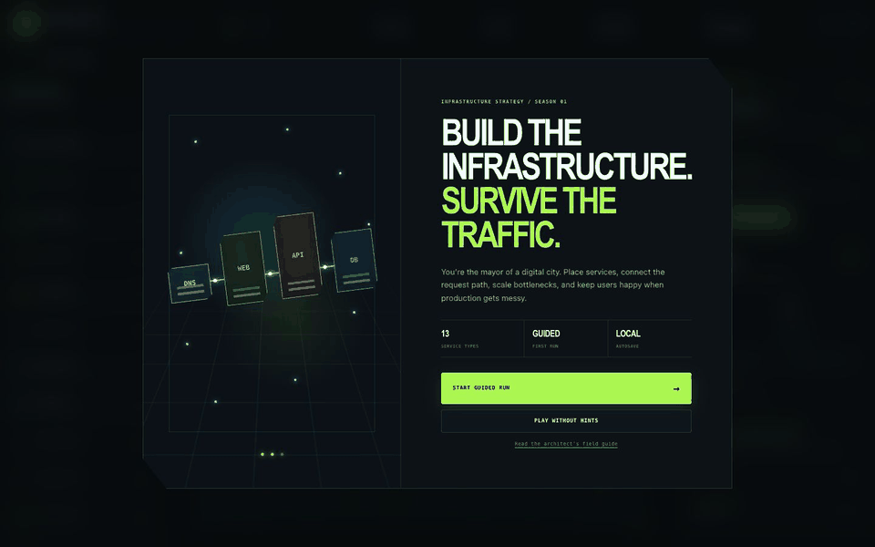
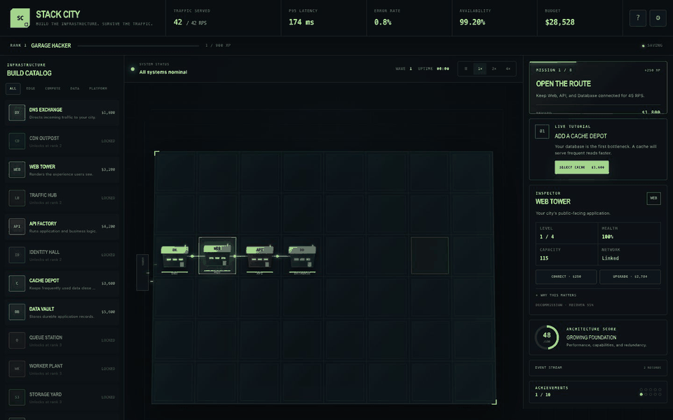
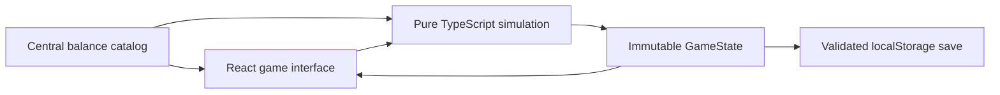

# Stack City

<p align="center">
  <strong>Build the infrastructure. Survive the traffic.</strong><br />
  A local-first systems architecture strategy game for the browser.
</p>

<p align="center">
  <a href="https://stack-city-eight.vercel.app">Play live</a> ·
  <a href="#how-to-play">How to play</a> ·
  <a href="#service-catalog">Service catalog</a> ·
  <a href="#local-development">Run locally</a>
</p>

Stack City turns software architecture into a city-building game. Each building
is a real infrastructure concept, every glowing packet is a user request, and
every choice changes capacity, latency, availability, operating cost, and user
satisfaction. There are no accounts, API keys, ads, or paid services: open the
game and start building.

## Video demos

### Guided first run

The optional six-step walkthrough explains missions, telemetry, construction,
request routing, bottlenecks, and live hints before the first wave begins.



### Build and connect a cache

Guided hints react to the current city. This demo selects a Cache Depot, places
it on the map, and connects it to the API request path.



## What is in the game

- 13 infrastructure types across edge, compute, data, and platform layers
- three operations scenarios with distinct budgets, traffic curves, revenue,
  and incident pressure
- a deterministic simulation of traffic, capacity, saturation, latency,
  availability, errors, revenue, operating cost, and user satisfaction
- building placement, network links, four upgrade levels, repairs, and resale
- incidents with service damage, recovery windows, and on-call costs
- eight campaign objectives, five ranks, and ten achievements
- an optional first-run walkthrough, adaptive live hints, and an architecture
  field guide
- pause plus 1×, 2×, and 4× simulation speeds
- validated, versioned local autosave
- keyboard, touch, reduced-motion, high-contrast, and responsive support

## How to play

### 1. Choose your starting experience

Open the [live game](https://stack-city-eight.vercel.app). First choose an
operations drill:

- **Steady Growth** is the balanced campaign and the best first city.
- **Launch Day** provides more capital and revenue, but traffic grows much
  faster.
- **Chaos Lab** raises incident pressure and rewards observability and
  redundancy.

Then choose one of two learning paths:

- **Start guided run** opens the six-step walkthrough and keeps contextual
  hints active during play.
- **Play without hints** starts the simulation immediately.

Returning players can continue their local city or replay the walkthrough. The
Settings panel can turn guided hints on or off at any time.

### 2. Read the current mission

The mission card in the right-hand operations rail is your immediate goal.
Completing missions awards budget and XP; earning XP raises your rank and
unlocks more advanced services. The campaign progresses from keeping a basic
request route alive to serving 210 RPS with an architecture score of 80.

### 3. Watch the live signals

The top bar and telemetry strip explain what the city is experiencing:

| Signal | What it means | Healthy target |
| --- | --- | --- |
| Traffic served | Requests completed versus incoming demand | Serve the full wave |
| p95 latency | Response time for the slowest common requests | Under 250 ms |
| Error rate | Requests that fail under load or damage | Under 1% |
| Availability | Successful-service ratio over time | At least 99% |
| Saturation | Demand divided by effective capacity | Preferably under 82% |
| Budget / net per tick | Cash reserves and current profitability | Keep both positive |
| User satisfaction | Combined reliability and performance score | 88% or higher |

Yellow is an early warning; red means the city needs action. Pause the
simulation if you need time to inspect a service or redesign the route.

### 4. Build a service

Choose an unlocked card from the build catalog, then choose an empty tile on
the city grid. Construction cost is paid immediately and upkeep is charged as
the simulation advances. Building placement is flexible; connectivity, not
physical adjacency, controls the request path.

### 5. Connect the request path

An isolated service cannot affect traffic. Select a building, choose
**Connect**, then choose another building. Each link costs $250. A working core
route needs Web, API, and Database services connected; optional services add
offload, protection, observability, or asynchronous capacity.

### 6. Scale the bottleneck

The narrowest required layer limits the entire stack. Select a building to see
its health, capacity, network state, and upgrade price. Upgrade the saturated
layer, add a replica, or introduce the specialized service that reduces its
work. Replicated APIs become fully effective once a Traffic Hub is present.

### 7. Handle incidents

Incidents appear in the operations rail and damage a specific service while
active. Pay the response cost to resolve them quickly, or accept degraded
latency, errors, and availability until the incident expires. A connected
Watchtower reduces incident impact and represents metrics, logs, traces, and
actionable alerting.

## Controls

| Action | Mouse / touch | Keyboard |
| --- | --- | --- |
| Build | Select a catalog card, then an empty tile | Tab to controls and press Enter |
| Inspect | Select a building | Tab to a grid cell and press Enter |
| Connect | Select a building, choose Connect, then select a target | Keyboard-accessible controls |
| Pause / resume | Use the speed control | `Space` or `P` |
| Cancel a tool / close an overlay | Use Cancel or Close | `Escape` |
| Change speed | Choose 1×, 2×, or 4× | Tab and press Enter |

## Service catalog

| Service | Layer | Rank | Cost | Architectural role |
| --- | --- | ---: | ---: | --- |
| DNS Exchange | Edge | 1 | $1,800 | Directs incoming traffic to the city |
| CDN Outpost | Edge | 2 | $4,600 | Serves static traffic close to users |
| Web Tower | Compute | 1 | $3,200 | Renders the browser experience |
| Traffic Hub | Edge | 2 | $3,900 | Distributes traffic across replicas |
| API Factory | Compute | 1 | $4,200 | Runs application and business logic |
| Identity Hall | Platform | 2 | $4,400 | Validates identity and permissions |
| Cache Depot | Data | 1 | $3,600 | Reduces database work and response time |
| Data Vault | Data | 1 | $5,600 | Stores durable application state |
| Queue Station | Platform | 3 | $4,100 | Buffers work during traffic bursts |
| Worker Plant | Compute | 3 | $3,800 | Drains queued background jobs |
| Storage Yard | Data | 3 | $3,500 | Moves files and large objects out of the database |
| Search Works | Data | 4 | $5,200 | Answers indexed text queries efficiently |
| Watchtower | Platform | 1 | $2,800 | Reveals faults and reduces incident impact |

## Strategy guide

### Strong opening

1. Let the starter route complete its first mission.
2. Add a Cache Depot and connect it to the API or Data Vault.
3. Add and connect a Watchtower before incidents become expensive.
4. Preserve cash for one emergency repair instead of spending the entire
   starting budget.

### Mid-game scaling

- Upgrade the Data Vault when database capacity remains the narrowest layer.
- Add a CDN when frontend latency or work is growing.
- Add a second API plus a Traffic Hub before traffic exceeds a single API's
  effective capacity.
- Pair Queue Station with Worker Plant; either one alone provides limited
  asynchronous value.
- Keep some headroom. A design at 95% saturation is one incident away from a
  cascade.

### Diagnostic playbook

| Symptom | Likely cause | Best first move |
| --- | --- | --- |
| Route incomplete | Isolated or missing core service | Reconnect Web → API → Data |
| High latency, low errors | Growing saturation or database work | Add cache or upgrade the bottleneck |
| Errors spike with a wave | Capacity below demand | Upgrade or replicate the narrowest layer |
| Replicated APIs barely help | No traffic distribution | Add and connect a Traffic Hub |
| Incidents cause large drops | Weak observability / low health | Add Watchtower and resolve incidents |
| Budget falls every tick | Too much idle infrastructure | Sell unused services or grow served traffic |

## Guided mode and field guide

The walkthrough pauses the simulation while it explains the interface. Finishing
or skipping it resumes the city and leaves an adaptive hint card active. The
hint card first teaches cache placement, then connection, then confirms the
optimization. Settings includes **Guided hints** and **Replay guided
walkthrough** controls. The `?` button opens a deeper field guide covering
capacity, caching, resilience, queues, observability, and SLOs.

## Saving, privacy, and accessibility

Stack City stores one versioned save in the browser's `localStorage`. Save data
never leaves the device, is treated as untrusted input, and is validated before
restoration. The parser rejects oversized payloads, invalid numeric ranges,
duplicate IDs, overlapping buildings, forged connections, malformed events,
and unknown catalog data. Version 1 saves migrate locally to the current schema.
Starting a new city replaces that local save.

The interface supports keyboard navigation, touch targets, narrow screens,
high-contrast mode, reduced-motion mode, and the operating system's reduced
motion preference. Live events are announced through an accessible status
region, and every city tile has a descriptive label.

## Technical architecture



The production release uses Next.js 16 and React 19. The page is prerendered as
static content, then hydrated for gameplay. No application server, database,
authentication provider, analytics SDK, or external API is required.

Important files:

- `app/game/catalog.ts` — scenarios, services, missions, incidents, ranks, and balance
- `app/game/engine.ts` — deterministic state transitions and simulation rules
- `app/game/StackCityGame.tsx` — interaction and presentation controller
- `app/globals.css` — responsive visual system
- `tests/` — deterministic simulation and production-render checks
- `docs/ARCHITECTURE.md` — implementation model and security notes

## Local development

Requirements: Node.js 24 and npm.

```bash
git clone https://github.com/chadkraus87/stack-city.git
cd stack-city
npm install
npm run dev
```

Open the local address printed by Next.js.

### Scripts

| Command | Purpose |
| --- | --- |
| `npm run dev` | Start the local development server |
| `npm run build` | Create the production Next.js build |
| `npm start` | Serve the completed production build |
| `npm test` | Run simulation and prerendered-output tests |
| `npm run lint` | Run TypeScript, React, accessibility, and Next.js lint rules |
| `npm run check` | Run lint, production build, and every test |

## Verification and security

The release gate runs deterministic engine tests, production prerender checks,
TypeScript compilation, React and accessibility lint rules, desktop and phone
browser playtests, console-error inspection, and dependency audits.

Production responses set a restrictive Content Security Policy, block inline
event-handler scripts and framing, isolate cross-origin resources, disable MIME
sniffing and legacy cross-domain policies, restrict browser permissions, use a
strict referrer policy, and omit the framework signature header. The game does
not render raw HTML, execute user-supplied code, accept uploads, or store
secrets.

Run the same local gate with:

```bash
npm run check
npm audit
```

## Deploying to Vercel

The repository is Vercel-native and needs no environment variables:

1. Import the GitHub repository into Vercel.
2. Keep the detected framework as **Next.js** and the root directory as `.`.
3. Use the default install command and `npm run build`.
4. Deploy. Vercel will serve the prerendered page and apply the headers from
   `next.config.ts`.

## Contributing

Keep simulation logic deterministic, centralize balance changes in the catalog,
validate all saved state, preserve accessibility modes, and add tests whenever a
simulation rule changes. Run `npm run check` before opening a pull request.

## License

Copyright © 2026 Chad Kraus. No open-source license has been selected yet; the
public repository is available for viewing and evaluation.
